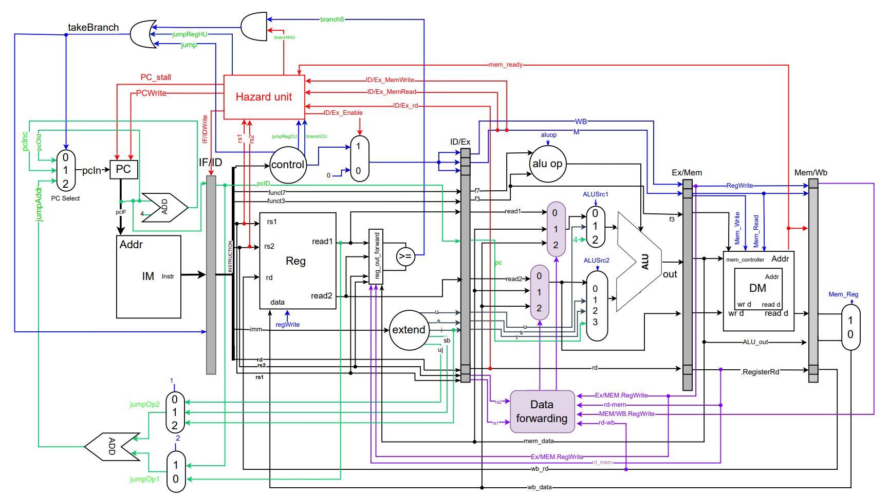

# RISC-V 32I 5 Stage Pipelined Processor

This is a RISC-V 32I processor which also supports the M extension.

## Datapath of the Processor

## Architecture

## Setup

1. Inlude all the [src/](src) files to the project
2. Add the absolute path of src/ins_mem_init.txt file to [ins_memory.sv](src/ins_memory.sv) `D:\\ACA\\SEM7_TRONIC_ACA\\17 - Advance Digital Systems\\2020\\assignment_2\\SoC_project\\src\\ins_mem_init.txt` (line 23)
3. Add the absolute path of src/data_mem_init.txt file to [data_memory.sv](src/data_memory.sv)
   `D:\\ACA\\SEM7_TRONIC_ACA\\17 - Advance Digital Systems\\2020\\assignment_2\\SoC_project\\src\\data_mem_init.txt` (line 21)
4. Add the absolute path of src/data_mem_final.txt file to [data_memory.sv](src/data_memory.sv)
   `D:\\ACA\\SEM7_TRONIC_ACA\\17 - Advance Digital Systems\\2020\\assignment_2\\SoC_project\\src\\data_mem_final.txt` (line 37)
5. Add the absolute path of src/reg_file_final.txt file to [reg_file.sv](src/reg_file.sv)
   `D:\\ACA\\SEM7_TRONIC_ACA\\17 - Advance Digital Systems\\2020\\assignment_2\\SoC_project\\src\\reg_file_final.txt` (line 54)
6. Compile and Run the Project
7. For the simulation run the [top_tb.sv](src/top_tb.sv)

<!-- ### Run a compiled code
1. Generate assembly code (use an online compiler)
2. Copy and paste assembly code into ./Assembly-To-Machine-Code-Risc-V/test.asm
3. Run ./Assembly-To-Machine-Code-Risc-V/A-to_M.cpp
4. Copy and paste the resultant content of MCode.mc into the ins_mem_init.txt
5. Run the RTL simulation from Quartus  -->

## Testing

- To test the processor we have supplied with 4 applications which are available in the testing folder.
  - [Factorial Iterative](testing/Factorial_iterative)
  - [Factorial Recursive](testing/Factorial_Recursive)
  - [Fibonacci Recursive](testing/Fibonacci_Recursive)
  - [Fibonacci Iterative](testing/Finonacci_iterative)
- Each folder consists of 3 files. These include;
  - The assembly code.
  - The generated machine code (instructions) for the respective assembly code.
  - The expected instructions in the instruction memory for that particular application. (\*\*\*instruction_memory.txt)
- To test any of these programs, you can either;

  - Replace the all _instructions_ in the [ins_mem_init.txt](../src/ins_mem_init.txt) which is available in **src** folder with the instructions found in the \**\*\*instruction*memory.txt file mentioned above,
  - Change the relevant _1st n_ instructions of the [ins_mem_init.txt](../src/ins_mem_init.txt) relative to the instructions available in the \*\*\*machine_code.txt.

- The result of these applications can be checked by;

  - Looking at the 1st location of the data memory [(data_mem_final)](../src/data_mem_final.txt), after the process is over.

- For futher testing of the aforementioned test cases follow the instuction mentioned in [Testing Document](testing/Readme.md)

<!-- ## Verification -->
